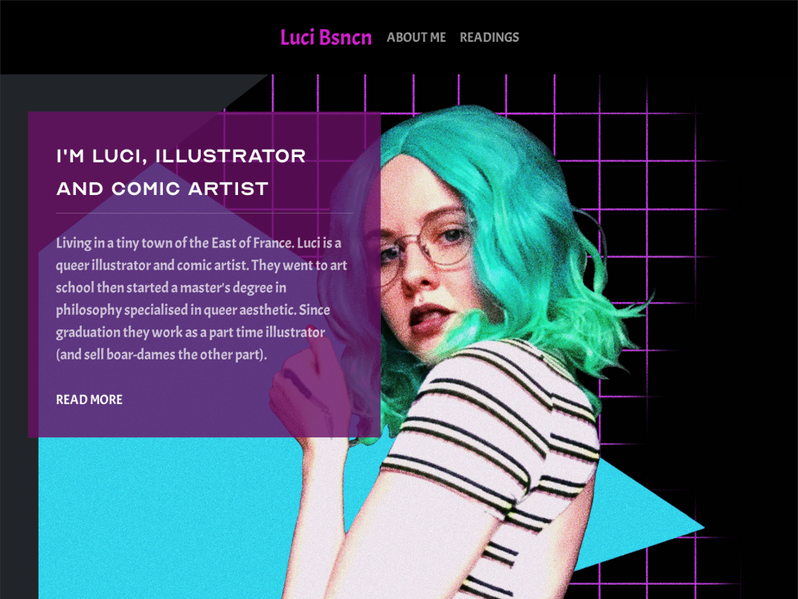

# Luci's Publii Theme

Based on Blank boilerplate theme, this has been crafted for the personal website of my sister for [Publii](https://getpublii.com/).

Contents:

* [Getting Started](#getting-started)
* [Usage](#usage)
  * [Adding a portfolio image](#adding-a-portfolio-image)
  * [Adding a post index page](#adding-a-post-index-page)
  * [Theme settings](#theme-settings)
* [Acknowledgements](#acknowledgements)
* [Updates](#updates)
  * [Updating from v0.2.0](#updating-from-v020)
* [License](#license)

## Getting Started

1. Download **latest ZIP archive** from assets in [latest release](https://github.com/bigbrozer/publii-luci-theme/releases).
2. Open Publii, [install or update the theme](https://getpublii.com/docs/installing-using-updating-themes.html#installingatheme) using the ZIP archive downloaded from previous step.
3. In `Site settings`, select `Install and use ➔ Luci` to **install** or **update** the theme. Click `Save Settings` button to apply modification.
4. See [Usage](#usage) for using and configuring the theme.

## Usage

Once the theme is installed, read following sections to know how to use and configure it.

### Adding a portfolio image

The portfolio (on homepage) is composed of posts with only a `title`, a `featured image`, has `Status ➔ Hide Post` set to true and ensure `Other options ➔ Post template ➔ Image for the portfolio` is set.

This combination will show the picture with a lightbox effect. The `title` is used as the image caption.

### Adding a post index page

To generate a post index page where you can list all available posts, create a new post with a title like **Post index**, select `Status ➔ Hide Post`, tag it as `post-index` and ensure you use template `Other options ➔ Post template ➔ Show the index of all posts`.

You will see a link appearing below the **Readings** section from homepage to access the post index page.

### Theme settings

From Publii, navigate to `Theme ➔ Custom settings` to customize the theme behavior.

## Acknowledgements

* [Lucie Besançon](https://me.labrume.art/) -- For all the GFX.
* [Blank theme](https://github.com/GetPublii/theme-Blank) -- Blank is an empty, basic Publii theme for developers.
* [UIKit](https://getuikit.com/) -- UIkit is a lightweight and modular front-end framework for developing fast and powerful web interfaces.
* [Release It!](https://github.com/release-it/release-it) -- Generic CLI tool to automate versioning and package publishing-related tasks.

## Updates

As this is a pre-release (below v1.x), sometime the theme will need some adaptations when upgrading. Follow the guide !

### Updating from v0.2.0

* In **Theme** menu on the left, enter the **Custom settings** area and set `Sidebar ➔ Number of posts: 2`. Save settings.
* From this release, you must hide all portfolio posts by enabling `Status ➔ Hide Post` in order to show them on the homepage.

## License

See [LICENSE](./LICENSE).
